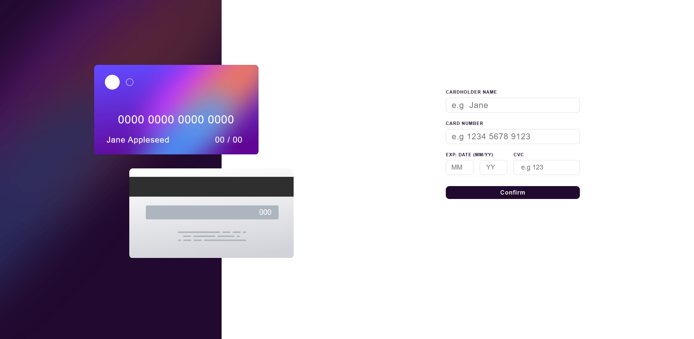
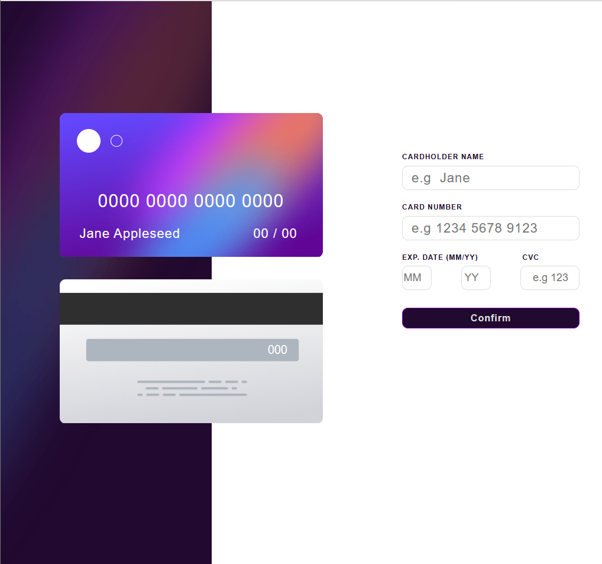
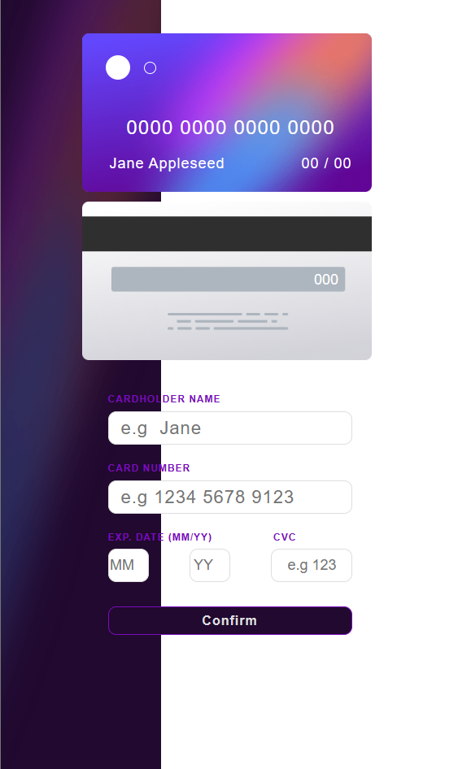
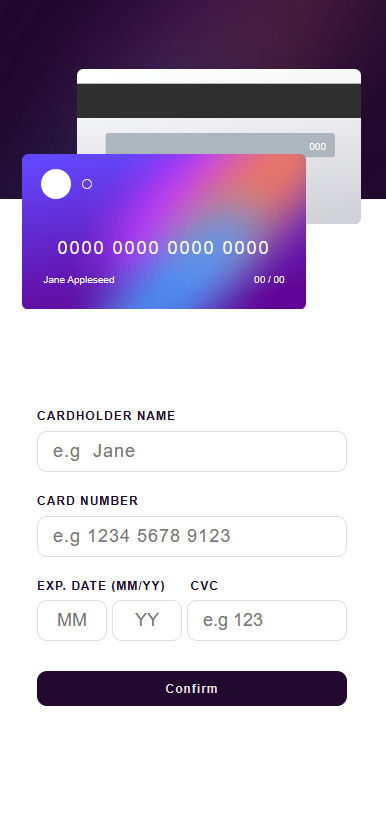

# Frontend Mentor - Interactive card details form solution

This is a solution to the [Interactive card details form challenge on Frontend Mentor](https://www.frontendmentor.io/challenges/interactive-card-details-form-XpS8cKZDWw). Frontend Mentor challenges help you improve your coding skills by building realistic projects.

[Livepage](https://kdebala.github.io/interactive-card-details-form/)

Table of contents

- [Overview](#overview):

  - [The challenge](#the-challenge)
  - [Screenshots](#screenshots)
  - [Links](#links)

- [My process](#my-process):

  - [Built with](#built-with)
  - [What I learned](#what-i-learned)
  - [Continued development](#continued-development)

- [Author](#author)
- [Acknowledgments](#acknowledgments)

## Overview

### The challenge

#### Users should be able to:

- Fill in the form and see the card details updated
- Receive error messages when the form is submitted if:

  - Any input field is empty
  - The card number, expiry date, or CVC fields are in the wrong format

- If there are no errors, display the completed state
- Reset the form when the user clicks "Continue" on the completed state
- View the optimal layout depending on their device's screen size
- See hover, active, and focus states for interactive elements on the page

### Screenshoots

<table>
        <tr>
		    <td>
                
            </td>
			            <td>
                
            </td>
            <td>
                
            </td>
            <td>
                
            </td>
        </tr>
</table>

### Links: [Livepage](https://kdebala.github.io/interactive-card-details-form/)

## My process

### Built with:

- Semantic HTML5 markup
- CSS custom properties
- Flexbox
- Mobile-first workflow
- JavaScript

(<a href="#top">back to top</a>)

### What I learned

This challenge was a really great learning opportunity, it was also very useful to reinforce previous knowledge and face problems that had not been presented to me before.This challenge is very good to practise CSS and Javascript.

(<a href="#top">back to top</a>)

### Continued development

I plan on taking up challenges that requires more Javascript writing to practise.

(<a href="#top">back to top</a>)

### Author

- [kdebala](https://github.com/kdebala)

### Acknowledgments

I would be glad if you can leave out some suggestion on how I can improve my code.

(<a href="#top">back to top</a>)

